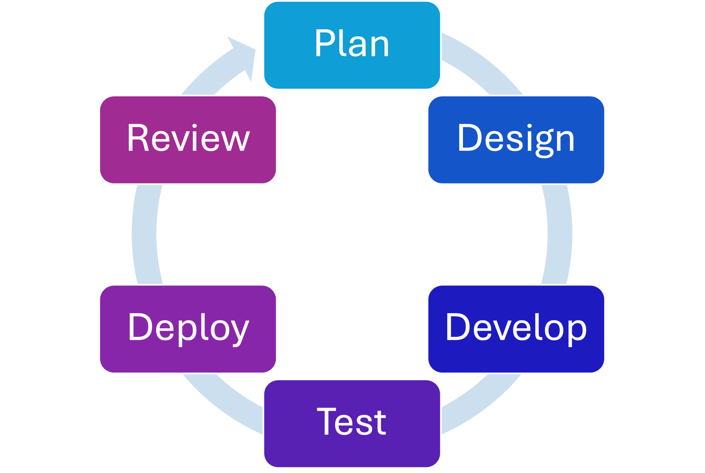

::::::::::::::::::::::::::::::::::::::: objectives

- Understand the Agile methodology.
- Learn its primary principles and what they look like in practice.

::::::::::::::::::::::::::::::::::::::::::::::::::

:::::::::::::::::::::::::::::::::::::::: questions

- What is the Agile methodology?
- What are the key principles of the Agile Manifesto?

::::::::::::::::::::::::::::::::::::::::::::::::::

## Agile Methodology

At the other end of the spectrum as the Waterfall-based methods are Agile methodologies.
When issues with the Waterfall-based methods became evident in the 1990s, Agile
methodologies surged in popularity because they are optimized to deal with poorly
understood and/or changing requirements during development.
They tend to incorporate other practices to improve software quality.

{alt='The Agile cycle, starting at Plan, flowing to design, develop, test, deploy, and ending at Review'}

::::::::::::::::::::::::::::::::::::::::::  discussion

## The Agile Manifesto

We are uncovering better ways of developing software by doing it and helping others do it.
Through this work we have come to value:

| We value… | …over… |
|-----------|--------|
| **Individuals and interactions** | processes and tools |
| **Working software** | comprehensive documentation |
| **Customer collaboration** | contract negotiation |
| **Responding to change** | following a plan |

Note the phrasing: the items on the right still have value — the items on the left
just have *more*. (Nearly) everything about Agile is based on one underlying value:
identify and eliminate sources of **WASTE**.

::::::::::::::::::::::::::::::::::::::::::::::::::::::

::::::::::::::::::::::::::::::::::::::::::  callout

## Agile does not mean "no plan, no docs"

A common misconception is that Agile means skipping planning and documentation.
It doesn't. Agile teams plan constantly — just in shorter cycles — and they write
the documentation that genuinely helps. The shift is *when* and *how much*, not
*whether*.

::::::::::::::::::::::::::::::::::::::::::::::::::::::

### Individuals and Interactions over Processes and Tools

- People come first: keep them happy, productive, and communicating. If a process
  or tool isn't working for people, **change it**.
- Favor lightweight, accessible tools over fancy, expensive packages.
- Communicate status, issues, and lessons learned **regularly** — ideally face-to-face.
- Protect people's time: meetings are **time-boxed** so developers can focus.

::::::::::::::::::::::::::::::::::::::::::  callout

## What this looks like in practice

- Shared whiteboards and simple text formats (Markdown, reStructuredText) over heavy tooling.
- Daily status meetings kept to **15 minutes**.
- Planning kept to about **1 hour per week** of development effort.
- A pace that can be sustained indefinitely — **without heroics**.

::::::::::::::::::::::::::::::::::::::::::::::::::::::

### Working Software over Comprehensive Documentation

The purpose of specs and design docs is to help get to useful, working software —
customers generally don't care about them once they have what they need. So Agile
teams keep **"just barely enough"** documentation: enough to develop, use, and
maintain the project, and no more. Good docs capture the **"big picture"** and the
**"why?"** — the things you *can't* easily figure out by reading the code.

::::::::::::::::::::::::::::::::::::::::::  callout

## Lightweight representations

- A whiteboard sketch of a UI workflow or domain model
- A 3x5 card with a brief user story on it
- GitHub Issues to capture feature requests and bugs

::::::::::::::::::::::::::::::::::::::::::::::::::::::

### Customer Collaboration over Contract Negotiation

"Contract negotiation" can quietly become: *"Give me a spec of what you want, then
leave me alone to go build it."* That makes a project less flexible — and Agile
**expects** requirements (or our understanding of them) to change. Instead, Agile
encourages constant collaboration within the team and with clients so everyone's
needs and goals stay aligned. Some approaches do deliberately limit *when*
requirements can change, to reduce **"requirements churn."**

### Responding to Change over Following a Plan

When requirements change, the current plan may no longer be the right plan. Agile
teams adapt by reviewing and revising plans **iteratively, over short time periods**,
and only plan the short- to medium-term in detail. Any effort spent on detailed
long-term plans is wasted as soon as things change — and they will.

Now you know more about the theory around the Agile Methodology.
In the next section, we will cover certain Agile development implementations.

:::::::::::::::::::::::::::::::::::::::: keypoints

- The Agile methdology is intended to be more iterative and responsive to changes in requirements.
- The Agile methodology focuses on individuals and interactions, working software, customer collaboration, and responding to change.

::::::::::::::::::::::::::::::::::::::::::::::::::
