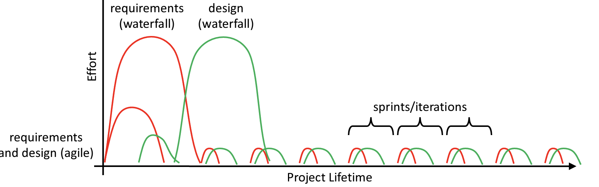

::::::::::::::::::::::::::::::::::::::: objectives

- Compare the Waterfall model and Agile approaches side by side.
- Identify the factors that make one methodology a better fit than another.
- Recognize that real projects often blend approaches.

::::::::::::::::::::::::::::::::::::::::::::::::::

:::::::::::::::::::::::::::::::::::::::: questions

- How do Waterfall and Agile compare?
- Which factors should guide my choice of methodology?
- Do I have to pick just one?

::::::::::::::::::::::::::::::::::::::::::::::::::

## Two Ends of a Spectrum

You've now seen the Waterfall model and Agile frameworks like Scrum and Kanban.
It's tempting to ask "which one is *best*?" — but the better question is "which one
fits **this** project, **this** team, right now?"

Agile does requirements gathering and design incrementally, mostly just before
implementation. A well-executed Waterfall project can actually be *less* costly
overall — **as long as the requirements and design don't change.** The catch, of
course, is that they usually do.

{alt='A graph of project lifetime vs. effort for agile and waterfall. Waterfall has large peaks in effort at the beginning, followed by predictable iterations. Agile has smaller upfront cost but also has similar predictable iterations.'}

The graph shows the trade-off: Waterfall front-loads a large planning and design
effort, betting that it gets things right early. Agile spreads that effort out,
accepting some ongoing cost in exchange for the ability to absorb change.

## What to Weigh

No single factor decides it. Look at the project as a whole:

| Factor | Leans **Waterfall** | Leans **Agile** |
|--------|---------------------|------------------|
| Requirements clarity | Clear and complete up front | Fuzzy or still being discovered |
| Likelihood of change | Low — stable scope | High — expect it to shift |
| Stakeholder availability | Involved early, then hands-off | Available throughout |
| Team size and co-location | Large, distributed, formal | Small, communicative |
| Timeline and delivery | One big delivery at the end | Frequent, incremental releases |
| Risk and uncertainty | Well-understood domain | Novel problem or technology |
| Regulatory / fixed-scope needs | Strict documentation, fixed contract | Flexible scope |

If most of your answers fall in the right-hand column — which is common for research
software — an Agile approach will usually serve you better.

::::::::::::::::::::::::::::::::::::::::::  callout

## Research software in practice

Research software rarely starts with stable requirements: the whole point is often
to explore something nobody has built yet. That pushes most research projects toward
Agile. But pieces of Waterfall still show up — a grant proposal is essentially an
upfront requirements-and-design document, and a paper deadline is a fixed release
date. Recognizing *which parts* of your project are stable and which are exploratory
helps you apply the right approach to each.

::::::::::::::::::::::::::::::::::::::::::::::::::::::

## It's Not Either/Or

In practice, very few teams run any methodology exactly as written. Hybrids are the norm:

- **Waterfall-ish planning, Agile execution** — do enough upfront design to satisfy
  a grant or stakeholders, then build iteratively in sprints.
- **Scrumban** — Scrum's cadence with Kanban's flexible flow.
- **Phase-appropriate** — a stable, well-understood component might be built
  Waterfall-style while an experimental one is developed iteratively.

The methodologies are tools, not identities. Borrow what helps and drop what gets in
the way — which is itself a very Agile thing to do.

::::::::::::::::::::::::::::::::::::::::::  discussion

## Which fits your project?

Think of a software project you're actually working on (or about to start).

- Where do its requirements fall on the clarity/change spectrum?
- Which approach — or blend — would fit best?
- What's one practice from this lesson you could adopt right away?

::::::::::::::::::::::::::::::::::::::::::::::::::::::

:::::::::::::::::::::::::::::::::::::::: keypoints

- There's no universally "best" methodology — only right-sized for a given project, team, and moment.
- Requirements clarity and likelihood of change are the biggest factors; stable scope favors Waterfall, change favors Agile.
- Most research software leans Agile, but real projects commonly blend approaches.

::::::::::::::::::::::::::::::::::::::::::::::::::
