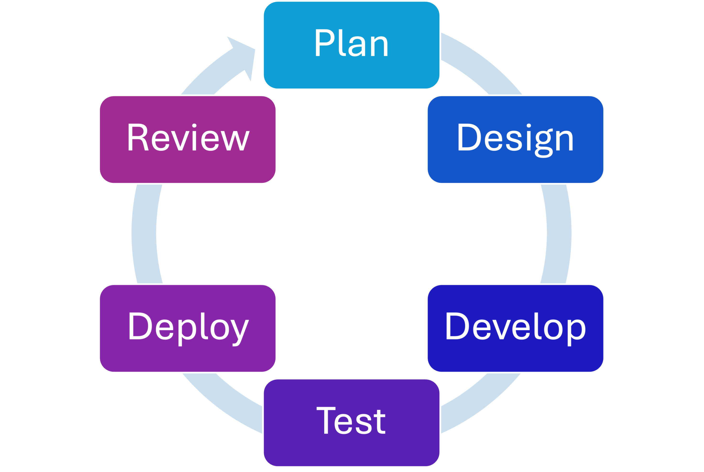

::::::::::::::::::::::::::::::::::::::: objectives

- Understand the Agile methodology.
- Learn its primary principles and what they look like in practice.

::::::::::::::::::::::::::::::::::::::::::::::::::

:::::::::::::::::::::::::::::::::::::::: questions

- What is the Agile methodology?
- What are the key principles of the Agile Manifesto?

::::::::::::::::::::::::::::::::::::::::::::::::::

## Agile Methodology

At the other end of the spectrum as the Waterfall-based methods are Agile methodologies.
When issues with the Waterfall-based methods became evident in the 1990s, Agile
methodologies surged in popularity because they are optimized to deal with poorly
understood and/or changing requirements during development.
They tend to incorporate other practices to improve software quality.

{alt='The Agile cycle, starting at Plan, flowing to design, develop, test, deploy, and ending at Review'}

::::::::::::::::::::::::::::::::::::::::::  discussion

## The Agile Manifesto

We are uncovering better ways of developing software by doing it and helping others do it.
Through this work we have come to value:

- **Individuals and interactions** over processes and tools
- **Working software** over comprehensive documentation
- **Customer collaboration** over contract negotiation
- **Responding to change** over following a plan

(Nearly) everything about Agile Development is based on one value:
Identify and eliminate sources of **WASTE**.

::::::::::::::::::::::::::::::::::::::::::::::::::::::

### Individuals and Interactions over Processes and Tools

Good processes and tools are important, but it's more important to make
sure that people are happy, productive, and communicating.
If a process or tool isn't working for people, change it!
Agile methods favor lightweight, widely accessible tools over fancy, expensive software packages.
This can mean collaborative whiteboards in public areas and simple text formats
like markdown and restructuredText for documents.
Agile methods promote a pace for software development that can be
sustained indefinitely and without heroics.

Agile methods incorporate very regular communication of status, identification of
issues, and retrospectives/postmortems on efforts.
This is preferably in face-to-face interactions like daily interactions between
software developers.
Planning and retrospective discussions are usually held every 1-4 weeks.

Agile methods also respect the time of individuals.
Meetings are time-boxed so that software developers can focus on the problems they are solving.
Daily status meetings are kept to 15 minutes and planning meetings are kept to 1
hour per week of development effort.

### Working Software over Comprehensive Documentation

Requirements specifications and design documents have one main purpose:  to
help get to useful, working software.
Customers generally don't care about them once they have their software!

Agile methods generally maintain only documentation that allows the project to
be developed, used, and maintained, and nothing more.
A common agile approach is "just barely enough" documentation.
The documentation should focus on what developers can't easily figure out looking
at the code, i.e., the "big picture," and "why?" rather than "what?"
Work should be completed "at the latest responsible moment."
Guards should be implemented to prevent wasted work from changing requirements.

Agile methods generally use lightweight representations for software requirements,
UI designs, software architecture/design, etc.:

- a whiteboard sketch of a UI workflow or domain model
- a 3x5 card with a brief user story described on it
- GitHub Issues to capture feature requests as well as bugs

### Customer Collaboration over Contract Negotiation

If "contract negotiation" really means:  "Give me a specification of what you
want, then leave me alone so I can go get it done," there might be a problem.
This can occur between team members, as well as between a team and its client,
and tends to make processes less flexible and adaptable to change.
Agile expects requirements, or the understanding of requirements, to change!

Agile methodology encourage constant collaboration within teams, and between
developers and clients, to ensure that everyone's needs and goals are being met.
Some agile approaches do limit opportunities for requirements to change in order
to reduce what is called "requirements churn."

### Responding to Change over Following a Plan

When requirements change, the current plan may no longer be the right plan.
Agile methods adapt to change by reviewing and revising plans iteratively, over short time periods.
Agile methods tend to only have detailed plans for the short- to medium-term.
If (when) changes come, any effort spent on detailed long-term plans would have been wasted.

Now you know more about the theory around the Agile Methodology.
In the next section, we will cover certain Agile development implementations.

:::::::::::::::::::::::::::::::::::::::: keypoints

- The Agile methdology is intended to be more iterative and responsive to changes in requirements.
- The Agile methodology focuses on individuals and interactions, working software, customer collaboration, and responding to change.

::::::::::::::::::::::::::::::::::::::::::::::::::
