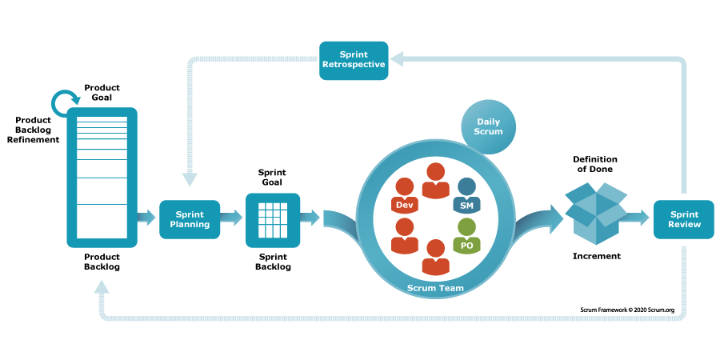
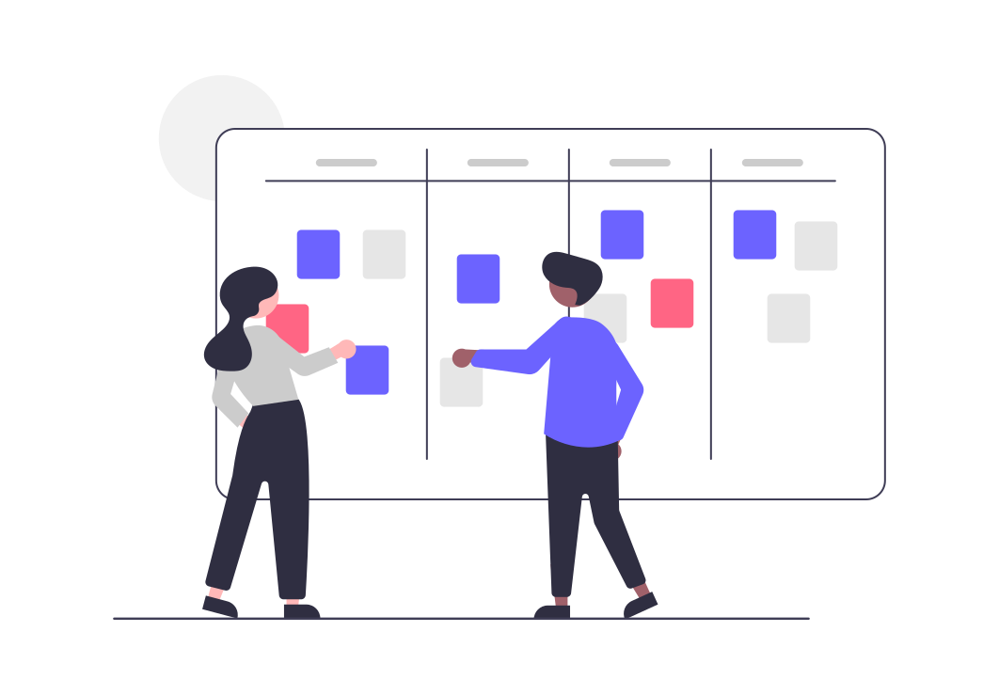

::::::::::::::::::::::::::::::::::::::: objectives

- Explore the Scrum, Kanban, and MoSCoW frameworks.
- Practice using Scrum and Kanban with a team.

::::::::::::::::::::::::::::::::::::::::::::::::::

:::::::::::::::::::::::::::::::::::::::: questions

- How is the Agile methodology used in practice?
- What are the features of various Agile frameworks?

::::::::::::::::::::::::::::::::::::::::::::::::::

## Scrum

**Scrum** (and its variants) is one of the most widely used Agile frameworks.
Scrum is a lightweight process that aims to break work into time-boxed iterations.

{alt='The Scrum Process - an interative process that flows from Product goal to Sprint planning to development (in increments) to Sprint review, looping back'}

::::::::::::::::::::::::: callout

## Who's who in Scrum

Scrum defines three roles. It helps to map them to today's exercise:

| Role | Responsibility | In our exercise |
|------|----------------|-----------------|
| **Product Owner** | Owns the vision and prioritizes the backlog; represents the customer | The "customer" |
| **Scrum Master** | Keeps the process running, removes blockers, protects the team | A designated member of your group |
| **Development Team** | Builds the product; estimates and commits to the work | Your group |

In research software these roles often blur — a PI might be the Product Owner, and
a single developer may wear all three hats. The *responsibilities* still need an owner,
even if the titles don't.

:::::::::::::::::::::::::::::::

### Project Vision

In the initial phase, project envisioning takes place.
How long this takes depends on the scope of the project and may take as much as 2-4 weeks.

During project envisioning, the client and the team define the following at high-level:

- **A project vision**: what the project is intended to accomplish.
  This should be no longer than a few pages at most (and often  times is much shorter).
- **A project backlog**: a list of key features to be implemented.
  In envisioning, the features tend to be high-level and broad
    - Typically expressed as "User Stories"
    - Future efforts will refine the details
- **An initial roadmap**: a series of releases that include features in the backlog 
    - The first release should be the "Minimal Viable Product"

::::::::::::::::::::::::: callout

#### Requirements as User Stories

User stories are created by describing software features or capabilities from a user's point of view.
This can be from the perspective of either regular users or an administrator.
They are written in "story" form and follow a "As a **ROLE**, I want to **GOAL**, so that **IMPACT**" form.
Here are some examples: 

- "As a user, I want to view my data, so that I can see trends."
- "As a user, I want to edit my data, so that I can fix mistakes or missing data."
- "As an administrator, I want to change the access rights of a user, so that I can make systems secure."

Here are some examples of user stories for non-functional requirements, though
they may not become separate tasks:

- "The system is robust against changes in the database format"
- "The system responds to a database commit in less than 50 ms"

:::::::::::::::::::::::::::::::::

After project envisioning is completed, development occurs in a series of
time-boxed iterations (1 week to 4 weeks) called sprints or iterations.

### Sprint Planning

Sprints start with a planning meeting, time-boxed to 1 hour per week. 
For example,for a 4-week sprint, the planning meeting may be no longer than 4 hours.
The developers choose features from the project backlog to be implemented in the sprint.
Larger features are decomposed into smaller features and details are discussed.
Feature priority is determined by the client and the team, based on relevance
to the product roadmap, risk/uncertainty, level of difficulty, etc.
Implementation cost of the features is determined by the developers.
The developers then commit to completing those tasks within the sprint.

::::::::::::::::::::::::: callout

## Estimating the work

How do developers figure out "implementation cost"? Rather than guessing exact hours,
Agile teams usually estimate *relative* effort:

- **Story points** — an abstract size (often Fibonacci: 1, 2, 3, 5, 8...) capturing
  effort, complexity, and uncertainty together.
- **Planning poker** — everyone privately picks an estimate, then reveals
  simultaneously; big disagreements spark a useful discussion before re-voting.
- **T-shirt sizes** — quick, coarse sizing (S / M / L / XL) when points feel like overkill.

The goal is to create a shared understanding of how much fits in a sprint.

:::::::::::::::::::::::::::::::

:::::::::::::::::::::: callout

## Defining the Work

In Scrum, the project backlog is the specification of what work remains to be done on the project. 
User stories are descriptions of features that can be implemented within a single sprint.
Epics are features that will require multiple sprints to complete.
Epics contain user stories that correspond to the epic.

Bugs are defined as software defects encountered in completed work.
Periodically, backlog grooming occurs.
This is when stories and epics that are no longer relevant to the project are
removed (e.g. because a requirement was later found to be unnecessary).

::::::::::::::::::::::::::::::

### Sprint Work

The Scrum team then completes their work throughout the sprint period.
They meet for daily stand-up meetings (generally 15 minutes) in which they discuss
what they did yesterday, what they plan to do today, and any blockers or issues
that may have occurred.

::::::::::::::::::::::::: callout

## Definition of Done

Teams agree up front on what **"done"** actually means — for example: code written,
tests passing, reviewed, and documented. A shared *Definition of Done* keeps "done"
from quietly meaning "works on my machine," and makes sprint reviews honest.

:::::::::::::::::::::::::::::::

### Sprint Review

At the end of the sprint is a sprint demo and a retrospective discussion.
This tends to be a short meeting or is first part of next sprint's planning
meeting where completed work is demonstrated to the client / stakeholders.
Remember, Agile places high priority on working software and customer collaboration.

Everyone discusses lessons learned in the sprint, such as what unexpected issues
had to be dealt with and what can be done better in future sprints.
A sprint may include releasing/deploying software, or it may not. 
This depends on where the team is with respect to the product roadmap.

## Other Agile Methodologies

### Kanban

Japanese for "Board," Kanban is a lightweight method for tracking work on a project.
While it was originally done using a board marked into columns and Post-It notes,
it integrates well with GitHub.
Kanban is typically best for small to medium size projects.

{alt='Two team members addressing a Kanban board with four columns.'}

Scrum and Kanban are both Agile, but they emphasize different things:

| | **Scrum** | **Kanban** |
|---|-----------|------------|
| Rhythm | Fixed-length sprints | Continuous flow |
| Roles | Defined (PO, Scrum Master, team) | No required roles |
| Change | Wait for next sprint | Add anytime |
| Best for | Coordinating a team toward releases | Steady streams of incoming work |

These aren't mutually exclusive — combining them is exactly what **Scrumban** (the
upcoming exercise) is about.

### MoSCoW

MoSCoW is a lightweight technique for prioritizing work, typically done in the sprint
planning meeting with a focus on the next release/sprint:

| Category | Meaning |
|----------|---------|
| **Must have** | Without this, we don't have a usable release |
| **Should have** | Important, but the release still works without it |
| **Could have** | Nice to have, not essential |
| **Won't have** | Not this time (maybe never) |

Work first on **Must haves**, then **Should haves** if time remains in the sprint.

:::::::::::::::::::::::::::::::::::::: callout

## Which methodology should you use?

We've now seen Waterfall and several Agile frameworks. How do they compare, and
how do you choose between them for a real project? That's the focus of the next
episode, **Choosing a Methodology**.

::::::::::::::::::::::::::::::::::::::::::::::::::

:::::::::::::::::::::::: instructor

## Suggested break point

If you teach this lesson in two parts, this is the natural place to take your break.
Session 1 ends here (Introduction through the Scrum/Kanban/MoSCoW theory); the
Scrumban exercise below opens Session 2 while attendees are fresh, since it needs an
uninterrupted block of time to succeed. See the Instructor Notes for the full schedule.

::::::::::::::::::::::::::::::::::::::

::::::::::::::::::::::::::::::::::::: challenge

## Scrumban

Did you know that you can combine features from both Scrum and Kanban? This is
called Scrumban! In this exercise, you will be using LEGOs :tm: to build a car.

{alt='A car icon - created by Freepik on Flaticon.'}

0. Split into 4 groups and grab a set of LEGOs :tm:.
1. (4 min) Product vision: gather requirements, goals, visions, etc., from your customer.
2. (4 min) Project backlog: Create a Kanban board for your project on one of the walls near you
   with the columns "To Do", "In Progress", and "Done". Create your "backlog" by writing the features
   or work to be done on the sticky notes and putting them in the "To Do" column.
3. (2 min) Sprint planning: Decide what work will be completed this sprint. Prioritize your
   backlog (try MoSCoW!) and move the sticky notes you commit to into the "In Progress" column.
4. (4 min) Sprint work: **BUILD**!
5. (2 min) Sprint review: Show what you have to your customer and get feedback. Make changes to
    your Kanban board as necessary (e.g., move completed work to "Done", adjust work in "To Do" if
    need be).
6. Repeat steps 3-5 two more times! (Three sprints total, ~8 min each.)

:::::::::: instructor

Choose two people to act as customers (either two of the attendees or other instructors/TAs).
Assign one of them as "Customer 1" and the other as "Customer 2".

Show them the appropriate images:

1. [Customer 1 - Racecar](fig/customer1-car.jpg)
2. [Customer 2 - RV](fig/customer2-car.jpg)

Assign two groups to each customer. The groups will ask questions together but then
separate to do their individual work. The intent of this is to see how two groups
who gathered the same information may approach work differently.

Instructions to give to the customers:

> Stage 2 - Agile Methodology / Scrumban: The attendees will break up into 4 groups
> - two groups assigned to each customer. You will be given a picture of a car.
> **WITHOUT SHOWING THEM THE PICTURE**, you will describe the requirements for
> the car in the picture to them. Start really basic / high level / vague
> like customers sometimes do. "I want you to build me a car." The attendees
> should then start asking you questions about the house: "How many wheels? How many
> windows and doors?" (etc. etc.) They don't get as much time for this - only 4 minutes.
> Then they go through a Kanban board task writing / backlog creation stage for 4 minutes.
> They will then do a "sprint" / iteration (about 8 minutes each: 2 min plan, 4 min build,
> 2 min review) and try to get something created. They bring it back to you. You tell them
> what's right / wrong. They adjust their Kanban board / plan their next "sprint" (repeat for
> three total iterations). The slightly longer planning time is intentional — prioritizing
> and re-planning between sprints is the core skill this exercise teaches.

:::::::::::::::::::::

::::::::::::::::::::::::::::::::::::::::::::::::

::::::::::::::::::::::::::::::::::::::: discussion

How was that experience? What did you like? What did you dislike?

::::::::::::::::::::::::::::::::::::::::::::::::::

You now have hands-on experience with both ends of the methodology spectrum. Next,
we'll look at how to **choose** between them.

:::::::::::::::::::::::::::::::::::::::: keypoints

- The Scrum framework focuses on time-boxed iterations of work with consistent customer feedback.
- The Kanban method relies on visual tracking of work.
- The MoSCoW method focuses on labeling work as "Must haves", "Should haves", "Could haves", and "Won't haves."

::::::::::::::::::::::::::::::::::::::::::::::::::
